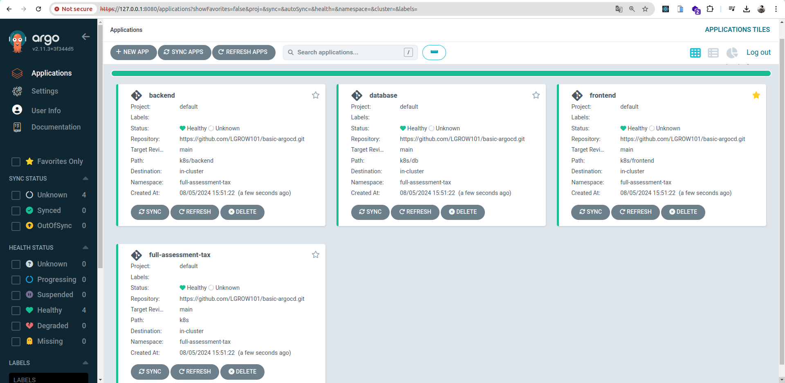

<p align="center">
  
</p>

```
git clone git@github.com:LGROW101/basic-argocd.git

cd  basic-argocd

```

## create cluster

```
kind create cluster

```

## Install Argo CD

```
kubectl create namespace argocd
kubectl apply -n argocd -f https://raw.githubusercontent.com/argoproj/argo-cd/stable/manifests/install.yaml
kubectl get all -n argocd
kubectl port-forward svc/argocd-server -n argocd 8080:443

kubectl -n argocd get secret argocd-initial-admin-secret -o jsonpath="{.data.password}" | base64 -d; echo

```

## apply

```
kubectl apply -f k8s/frontend
kubectl apply -f k8s/db
kubectl apply -f k8s/backend
kubectl apply -f k8s/argocd

```

```
kubectl get all

```
